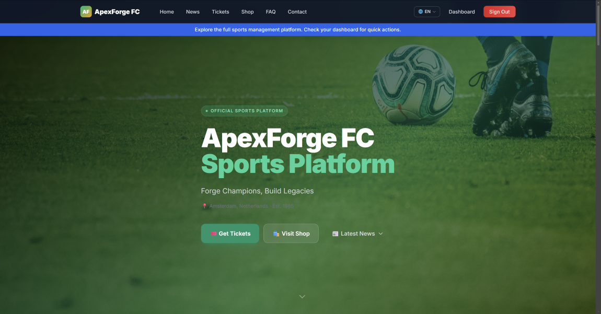
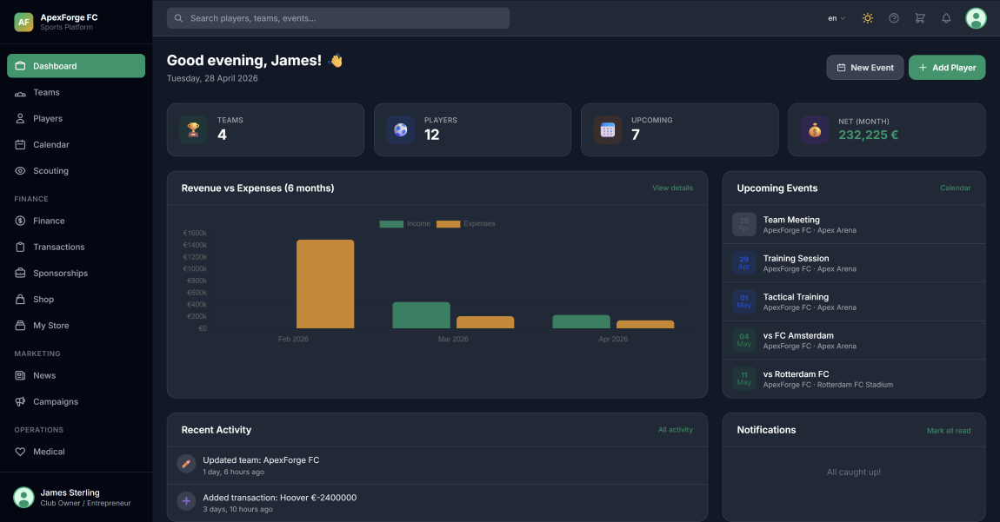
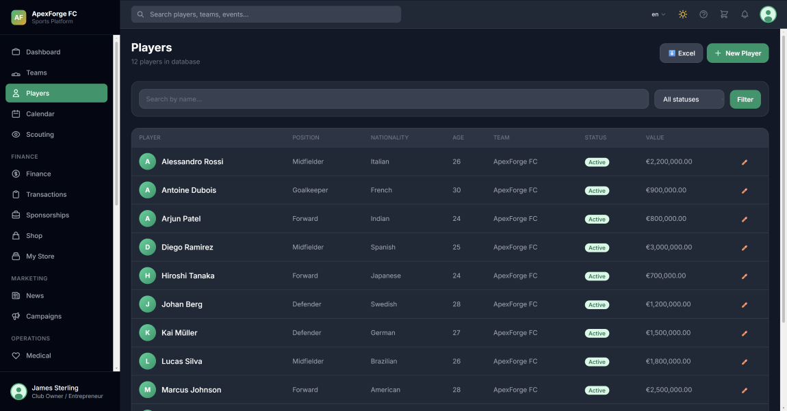
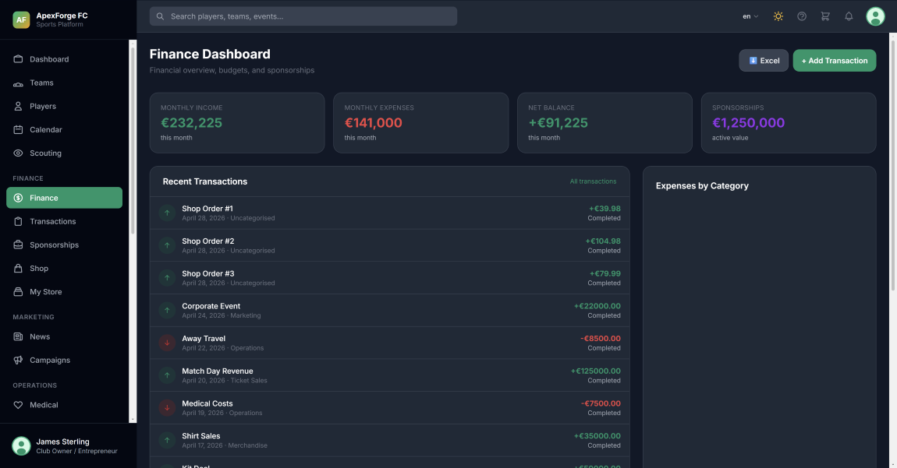
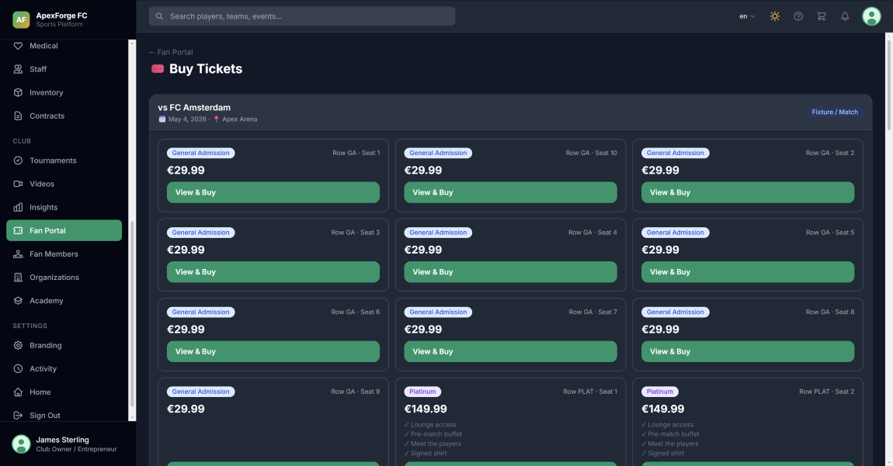

# ApexForge — Free / Community Edition

**Sport management platform for clubs, academies, and teams**
**Vendor:** [DjangoZen](https://djangozen.com)  ·  **Version:** 1.0.0



---

## About

ApexForge is a Django-based sport management platform for clubs, coaches, athletes, scouts, and sport entrepreneurs. This is the **Free / Community Edition** — a working preview you can run locally to evaluate the platform, study the codebase, or use for personal, non-commercial purposes.

**4 modules are functional** in this edition (Dashboard, Teams, Players, Accounts). The remaining **14 modules ship as code** (so you can read the implementation) but are **locked behind an upgrade prompt** when accessed in the running app.

For full functionality — all 18 modules unlocked, the **Fan Portal**, multi-club / multi-tenant support, white-label rights, and priority support — see the **[Pro Edition on djangozen.com →](https://djangozen.com/saas/product/apexforge-pro/)**.

---

## Demo

The repository ships with a pre-populated `db.sqlite3` so you can log in immediately after starting the server:

| Role | Email | Password |
|---|---|---|
| Manager | `manager@apexforge.com` | `demo123` |

---

## Quick Start

```bash
git clone https://github.com/DjangoZenDev/apexforge.git
cd apexforge
python -m venv .venv
.venv\Scripts\activate          # Windows
source .venv/bin/activate       # macOS / Linux
pip install -r requirements.txt
cp .env.example .env
python manage.py runserver
```

Then open **http://127.0.0.1:8000** and log in with the credentials above. Full step-by-step in [INSTALLATION.md](INSTALLATION.md).

---

## ✅ What's Functional in This Edition (4 Modules)

| Module | Status | Purpose |
|---|---|---|
| `core` | ✅ Functional | Dashboard, branding, notifications, global search, activity log |
| `accounts` | ✅ Functional | Authentication, profiles, role management |
| `teams` | ✅ Functional | Teams, rosters, seasons, divisions |
| `players` | ✅ Functional | Athlete profiles, stats, performance |

## 🔒 What's Locked (Upgrade to Pro to Unlock)

The following 14 modules are present in the codebase (so you can study the implementation), but accessing them in the running app redirects to the upgrade page:

| Module | Purpose |
|---|---|
| `events` | Calendar, fixtures, training sessions |
| `scouting` | Talent database, watchlist, scouting reports |
| `finance` | Budget planner, merchandise shop, Stripe checkout, inventory |
| `marketing` | News, announcements, sponsor portal |
| `medical` | Injury tracking, medical records |
| `contracts` | Contract management with expiry alerts |
| `staff` | Staff profiles, task assignment |
| `tournaments` | Tournament bracket management |
| `academy` | Youth and academy team management |
| `inventory` | Equipment and stock management |
| `videos` | Video upload and management hub |
| `organizations` | Multi-club organizational structure |
| `insights` | Analytics, KPIs, charts |
| `fans` | Fan Portal — ticketing, loyalty points, fan engagement |

The **Pro Edition** unlocks all 14 of these for 18 total functional modules.

---

## Screenshots

### Dashboard


### Players


### Finance


### Fan Portal & Tickets *(Pro Edition only)*


---

## What's in Pro (not in this edition)

- 🎟️ **Fan Portal** — ticketing, loyalty points, fan engagement
- 🏢 **Multi-tenant / multi-club** support
- 🎨 **White-label rights** — sell as your own SaaS
- 📊 **Advanced analytics + PDF / Excel exports**
- 🔧 **Priority email support** (24–48h)
- 🚀 **Lifetime updates**

[See full feature comparison and pricing →](https://djangozen.com/saas/product/apexforge-pro/)

---

## Tech Stack

Django 5.2 LTS · Python 3.12+ · Tailwind CSS · HTMX · Alpine.js · SQLite (dev) / PostgreSQL (prod) · Stripe · Chart.js

---

## License

This edition is released under a **source-available licence** — see [LICENSE.md](LICENSE.md).

In short: free for evaluation, learning, and non-commercial self-hosting. Commercial / SaaS / multi-deployment use requires a Pro license.

---

## Support

| Channel | Where |
|---|---|
| Bug reports | [GitHub Issues](https://github.com/DjangoZenDev/apexforge/issues) |
| Pro purchase & sales | https://djangozen.com/saas/product/apexforge-pro/ |
| Documentation | https://djangozen.com/docs/apexforge/ |

---

**© 2026 DjangoZen** — Built for champions.
